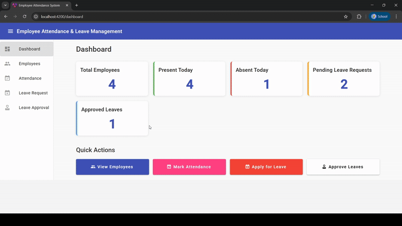

# Employee Attendance & Leave Management System

A responsive web application built with Angular 17+ and TypeScript for managing employee attendance and leave requests.

## 🚀 Features

- **Dashboard** - View key metrics and statistics at a glance
- **Employee Management** - Display and manage employee information
- **Attendance Tracking** - Mark daily attendance with check-in/check-out times
- **Leave Requests** - Employees can apply for different types of leave
- **Leave Approval** - HR module to approve or reject leave requests

## 🛠️ Technologies Used

- **Framework:** Angular 17+ (Standalone Components)
- **Language:** TypeScript
- **UI Library:** Angular Material
- **Architecture:** Modular with Services and Reactive Forms
- **Routing:** Angular Router
- **State Management:** RxJS Observables

### Screenshot



### Preview
[Click Here](https://employee-attendance-system-ochre.vercel.app/dashboard)

## 📋 Prerequisites

- Node.js (v16 or higher)
- npm (comes with Node.js)
- Angular CLI

## 🔧 Installation

1. Clone the repository:
```bash
git clone https://github.com/abhishanfrancis/employee-attendance-system.git
cd employee-attendance-system
```

2. Install dependencies:
```bash
npm install
```

3. Run the application:
```bash
ng serve
```

4. Open your browser and navigate to:
```
http://localhost:4200
```

## 📁 Project Structure

```
src/
├── app/
│   ├── components/
│   │   ├── dashboard/
│   │   ├── employee-list/
│   │   ├── attendance-tracker/
│   │   ├── leave-request/
│   │   └── leave-approval/
│   ├── models/
│   │   └── employee.model.ts
│   ├── services/
│   │   ├── employee.service.ts
│   │   ├── attendance.service.ts
│   │   └── leave.service.ts
│   ├── app.component.*
│   ├── app.config.ts
│   └── app.routes.ts
└── styles.css
```

## 🎯 Features in Detail

### Dashboard
- Total employees count
- Present/Absent statistics for today
- Pending leave requests count
- Approved leaves count
- Quick action buttons

### Employee List
- View all employees in a table format
- Display employee details (ID, Name, Email, Department, Position, Join Date)

### Attendance Tracker
- Mark attendance for employees
- Select date and status (Present/Absent/Half-Day/Late)
- Record check-in and check-out times
- View attendance history

### Leave Request
- Apply for leave
- Choose leave type (Sick/Casual/Vacation/Personal)
- Select start and end dates
- Provide reason for leave

### Leave Approval (HR Module)
- View all leave requests
- Approve or reject pending requests
- Track status of all leave applications

## 🔄 Future Enhancements

- [ ] Connect to REST API backend
- [ ] Add authentication and authorization
- [ ] Implement role-based access control
- [ ] Add reports and analytics
- [ ] Export data to Excel/PDF
- [ ] Email notifications
- [ ] Calendar view for attendance
- [ ] Employee profile management
- [ ] Multi-language support

## 🤝 Contributing

Contributions are welcome! Please feel free to submit a Pull Request.
